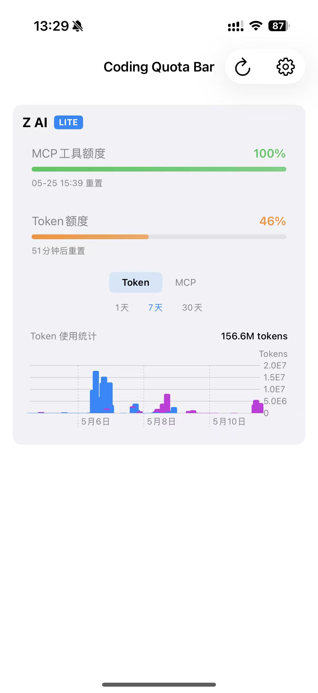
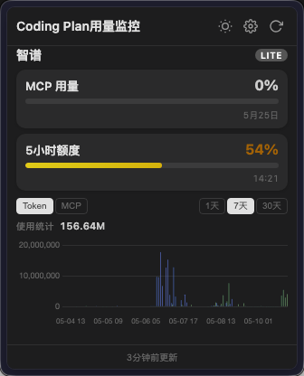
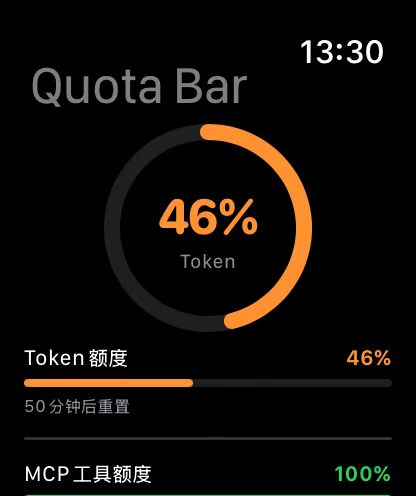

# Coding Quota Bar

一个监控 AI 编程助手用量的小工具。

用 Claude、ChatGPT、智谱这些 AI 写代码的时候，经常不知道额度还剩多少，等到用不了了才发现。这个工具就是把各个平台的用量直接显示在眼前——Mac 上挂菜单栏，Apple Watch 上抬手就看。

## 支持哪些平台

目前只支持**智谱 (GLM)**。

| 平台 | Mac 菜单栏 | iOS | Apple Watch |
|------|:---:|:---:|:---:|
| 智谱 (GLM) | ✅ | ✅ | ✅ |

显示内容：已用量、总额度、到期时间、重置时间。Mac 菜单栏图标会根据剩余比例变色（绿→黄→红）。

## 各端长什么样

**iOS**——主应用和桌面小组件：



**macOS 菜单栏**——常驻右上角，点开看详情，有图表：



**Apple Watch**——表盘 complication 直接显示用量百分比，打开 app 看详情：



## 怎么跑起来

### macOS 桌面版（Electron）

```bash
cd CodingQuotaBarMac
cp .env.example .env   # 填入你的 API Key
npm install
npm run dev             # 开发模式
npm run package:mac     # 打包 dmg
```

首次打开需要在设置里填对应平台的 API Key。

### iOS / watchOS（Xcode）

用 Xcode 打开根目录的 `CodingQuotaBar.xcodeproj`，选好 target 直接 Run。

Target 说明：
- **CodingQuotaBar** — iOS 主应用
- **CodingQuotaBarWidget** — iOS 桌面小组件
- **CodingQuotaBarWatch** — watchOS 应用
- **CodingQuotaBarWatchWidget** — watchOS 表盘小组件

需要配置 App Group（`group.top.hyizhou.codingquotabar`）来共享数据。

## 技术栈

- **Mac 桌面版**：Electron + Vue 3 + TypeScript + electron-vite
- **iOS / watchOS**：SwiftUI + WidgetKit + WatchConnectivity

## 致谢

本项目参考自 [coding-quota-bar](https://github.com/hyizhou/coding-quota-bar)（Windows 原版），在其基础上重写了 macOS / iOS / watchOS 客户端。完全 Vibe Coding，包括 git 操作。

## License

MIT
